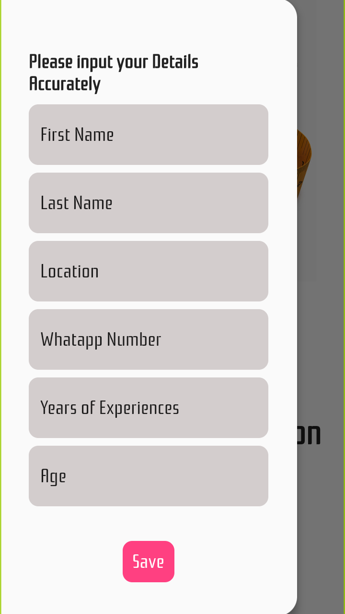

# moda App

a free market place for fashion companies to source for skilled workers in real time, extremely User friendly and highly responsive.

> Welcome to Moda App
> -------------------

### Tailor's Form, fill this for to recieve offers from potential employers

### Sign up page

### Employer's are expected to login to have access to all available tailors

### Employer's profile with active Data

### Employee's Data update form

>Todo:
> 1. Implement peer to peer chat
> 2. Implement Employee's profile
> 3. Implement Ecommerce platform
> 4. Implement CrytoCurrency for transactions withing the ecosystem

