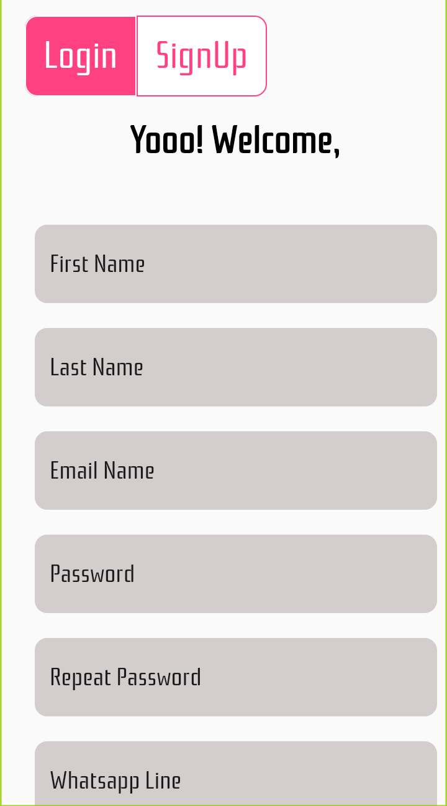
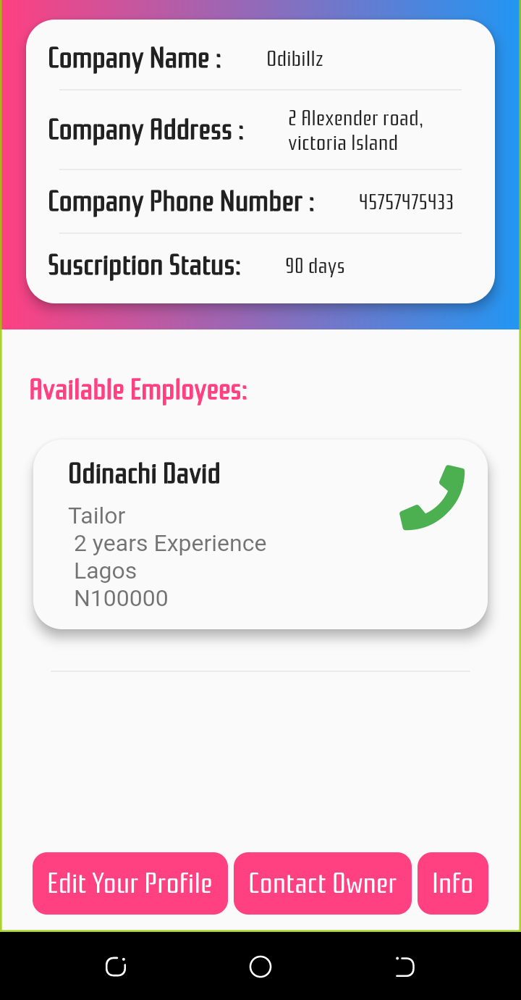

# moda App

a free market place for fashion companies to source for skilled workers in real time, extremely User friendly and highly responsive.

> Welcome to Moda App
> -------------------
{ width: 200px; height: 400px}

> Tailors to feel this for to recieve offers from potential employers
{ width: 200px; height: 400px}

> Sign up page
{ width: 200px; height: 400px}

> Employer's are expected to login to have access to all available tailors
{ width: 200px; height: 400px}

> Employer's profile with active Data
{ width: 200px; height: 400px}

> Employee's Data update form
{ width: 200px; height: 400px}

>Todo:
> 1. Implement peer to peer chat
> 2. Implement Employee's profile
> 3. Implement Ecommerce plateform
> 4. Implement CrytoCurrency for transactions withing the ecosystem

